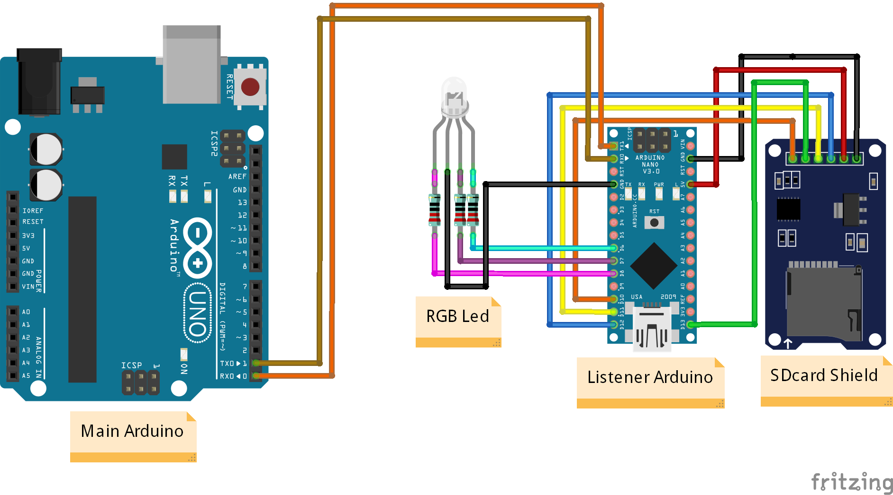

# Simple Serial to SDcard Shield

A simple adaptation that sets up an Arduino Nano to listen to the serial output of an Arduino Uno and pass this output to a .txt file on the SD card. It has an optional RGB LED that signals each operation performed.

This adaptation is applied in scenarios where the Main Arduino is using the necessary ports to support the SD card Shield itself, and can be applied to any board with Serial Output as long as the baud rate of the Listener is adjusted to the same value as the Main.

- Diagram:

